# Bioinformatics-Desktop-App

## Author:

> Name: Mohamed Ahmed

> email: mohamed.a.abdelmonem1@gmail.com

> linkedin: https://www.linkedin.com/in/mohamed-ahmed-97a3691b2/

## **I. Overview**

> Desktop Application using Python and QT Application Act as "Offline BLAST", The App is responsible for doing Pairwise Multiple Sequences Alignment (Global &amp; Local), Multiple Sequence Alignment, Generating Phylogenetic tree, Calculating Percentage of Chemical Components in DNA (A, C, G, T) &amp; RNA (A, C, G, U), Converting DNA to RNA (Transcription), and Converting DNA to Protein (Translation).

## **II. Features**

> 1. You can use it as BLAST tool but offline
> 2. Friendly UI
> 3. Handling errors to avoid app crash
> 4. Can extract results to an output file

## **III. Captures**

> #### **_1. Pairwise Sequence Alignment Tab_**
>
> |           Global Alignemnt Result            |               Local Alignment Result                |
> | :------------------------------------------: | :-------------------------------------------------: |
> | 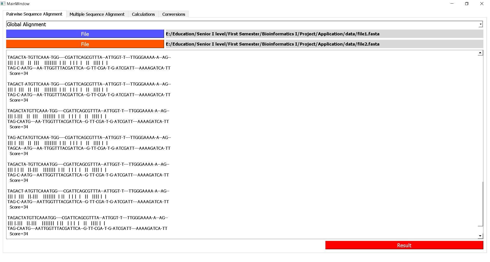 | 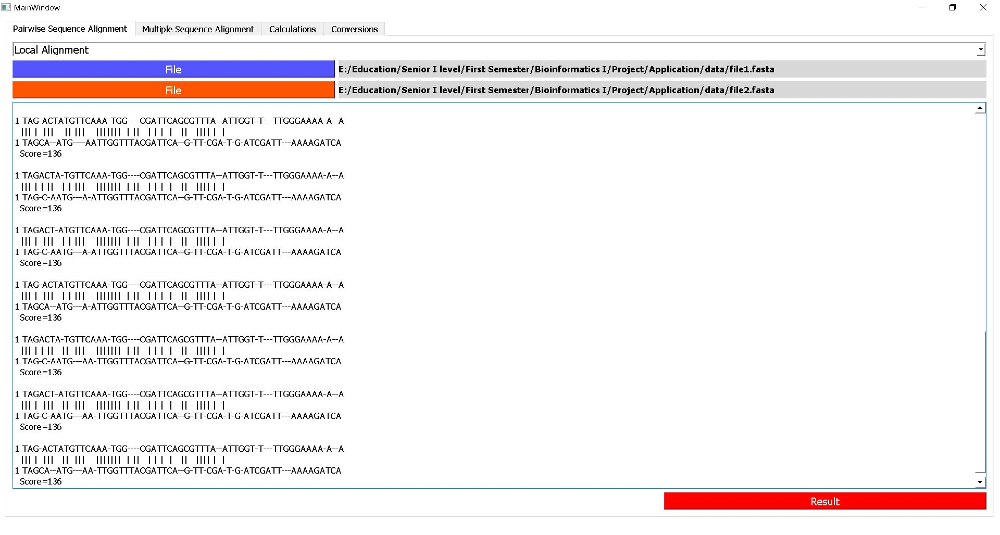 |

&nbsp;

> #### **_2. Multiple Sequence Alignment Tab_**
>
> |           Sequence Alignemnt Result           |               Phylogentic Tree Result               |
> | :-------------------------------------------: | :-------------------------------------------------: |
> | 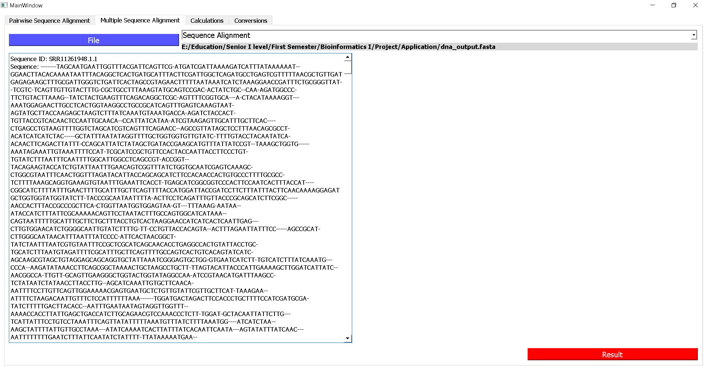 | 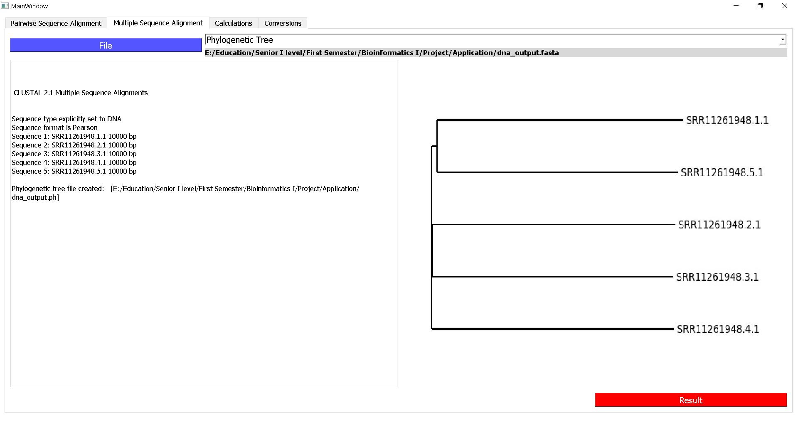 |

&nbsp;

> #### **_3. Calculations Tab_**
>
> This tab is esponsible for calculating percentage of Chemical Components in DNA, and RNA. It takes input as a fasta file or input text. User can extract output results to another file
> | DNA as input text | RNA as input Text |
> | :---------------------------------------------: | :-------------------------------------------------------------: |
> | 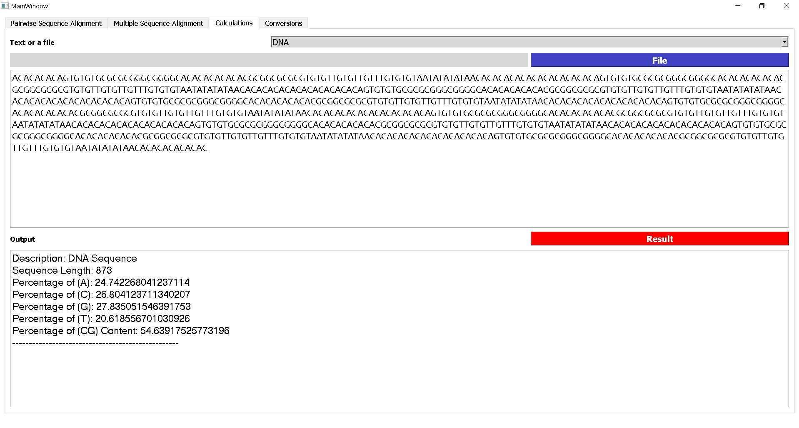 | 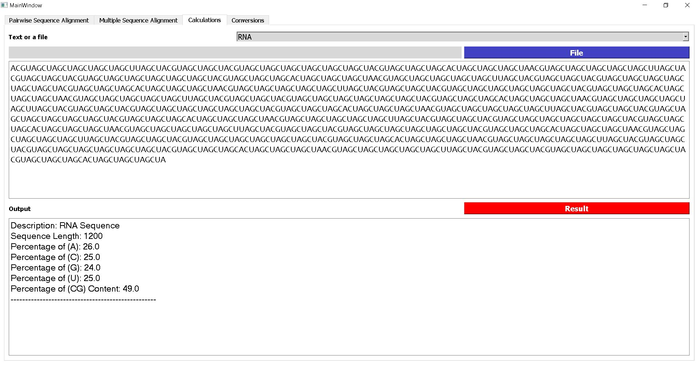 |

> |               DNA as input file                |               RNA as input file                |
> | :--------------------------------------------: | :--------------------------------------------: |
> | 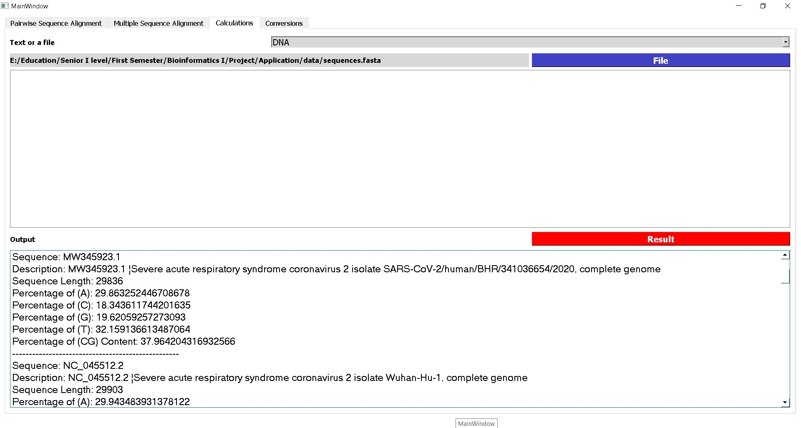 | 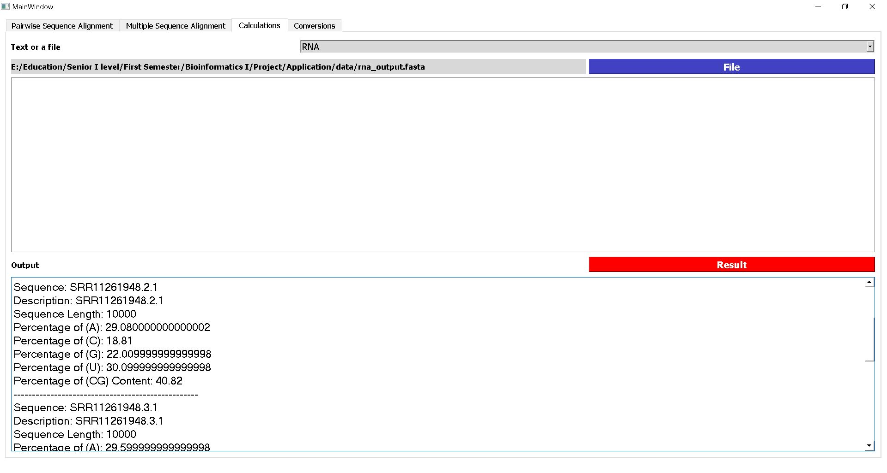 |

&nbsp;

> #### **_4. Conversions Tab_**
>
> This tab is responsible for converting DNA to RNA, and Converting DNA to Proteing. It takes DNA as a fasta file or DNA as a text.
> If the inpt is a file, user can extract output results to another file
> | DNA as input text - to RNA | DNA as input Text - to Protein |
> | :-----------------------------------------------------: | :---------------------------------------------------------: |
> | 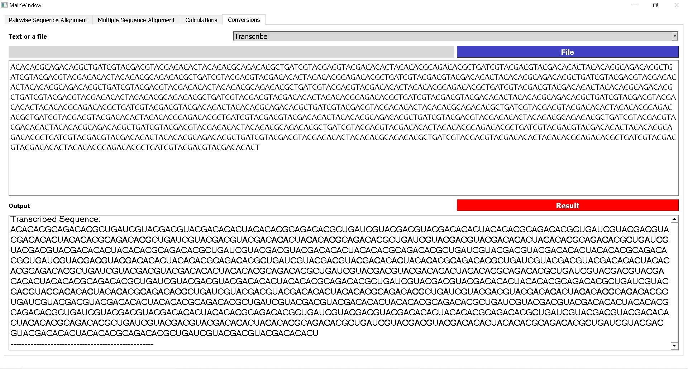 | 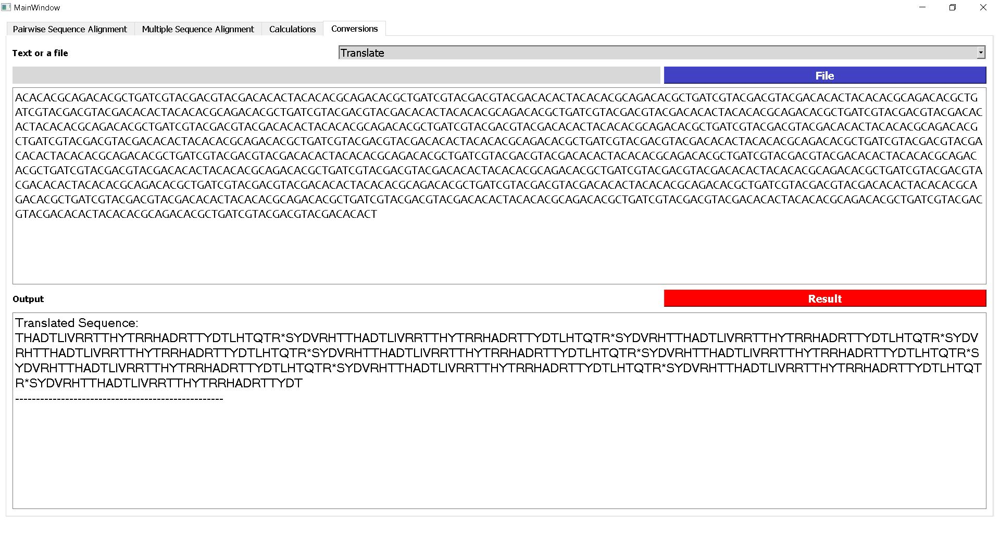 |

> |                DNA as input file - to RNA                |               DNA as input file - to Protein                |
> | :------------------------------------------------------: | :---------------------------------------------------------: |
> | 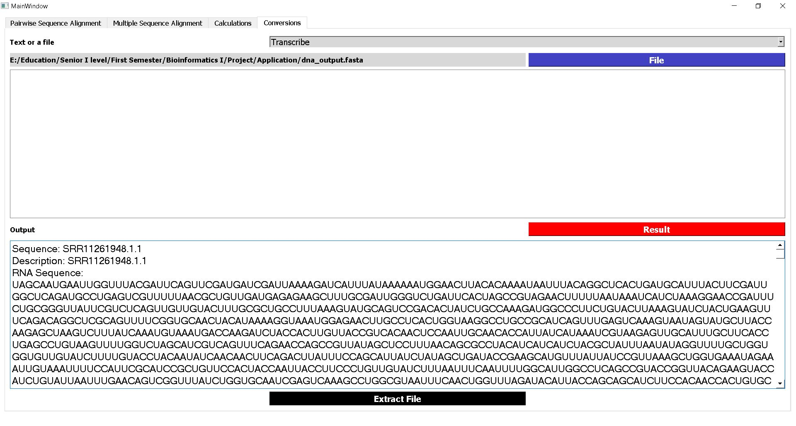 | 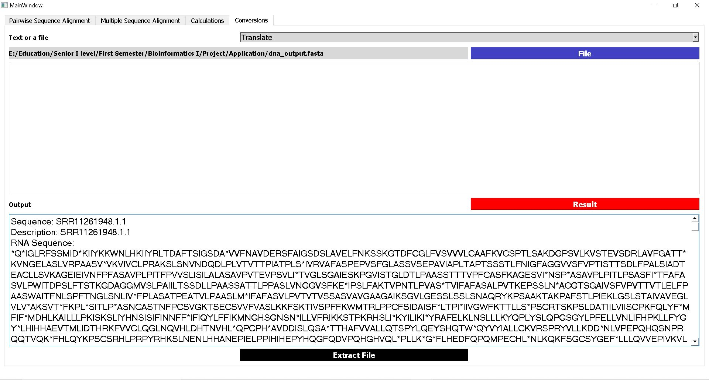 |
